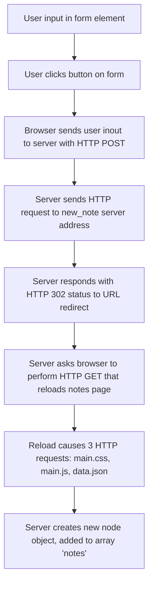

```mermaid
flowchart TD
    A[User input in form element] --> B[User clicks button on form];
    B --> C[Browser sends user inout to server with HTTP POST];
    C --> D[Server sends HTTP request to new_note server address];
    D --> E[Server responds with HTTP 302 status to URL redirect];
    E --> F[Server asks browser to perform HTTP GET that reloads notes page];
    F --> G[Reload causes 3 HTTP requests: main.css, main.js, data.json];
    G --> H[Server creates new node object, added to array 'notes'];
```
