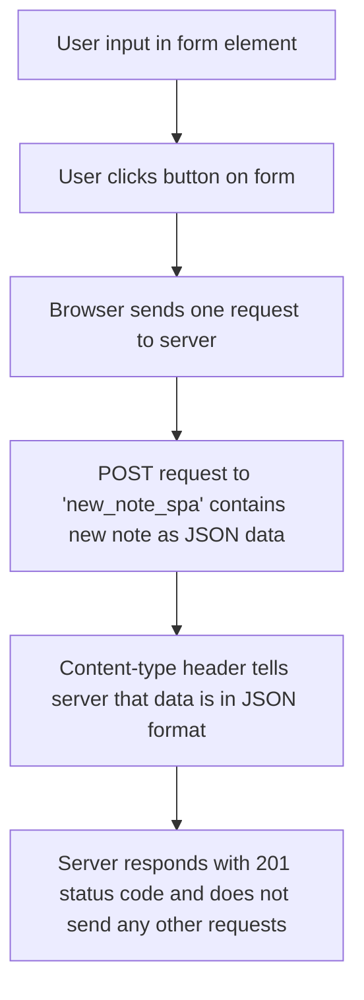

```mermaid
flowchart TD
    A[User input in form element] --> B[User clicks button on form]
    B --> C[Browser sends one request to server]
    C --> D[POST request to 'new_note_spa' contains new note as JSON data]
    D --> E[Content-type header tells server that data is in JSON format]
    E --> F[Server responds with 201 status code and does not send any other requests]
```
